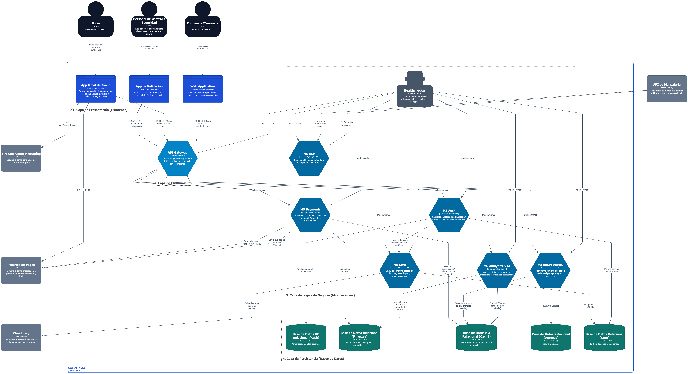
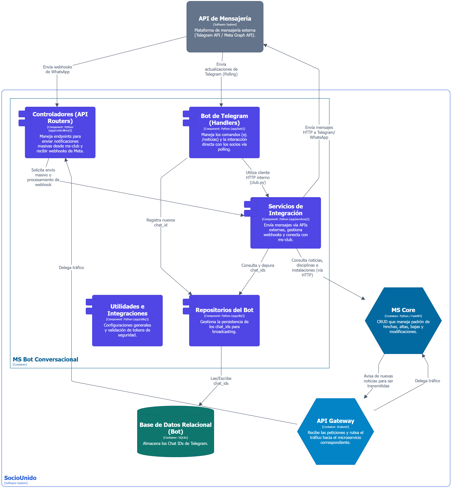

# 🏗️ Arquitectura y diagramas

A continuación se presentan los diagramas de arquitectura basados en el modelo C4 para entender la estructura, dependencias y el flujo de información de esta implementación en particular.

## Nivel 1: Contexto

## Nivel 2: Contenedores

## Nivel 3: Componentes

# 📱 Interfaz

Como parte integral del ecosistema, la plataforma cuenta con **BotIn**, un asistente conversacional desplegado a través de Telegram. Esta interfaz ofrece a los usuarios un canal de comunicación ágil y accesible, permitiendo realizar consultas y ejecutar comandos mediante un flujo de mensajes automatizados.

A continuación, se exhibe el perfil institucional del bot y una demostración de la interacción en tiempo real:

  <figure style="display: inline-block; margin: 10px; text-align: center;">
    
     
    <figcaption style="margin-top: 10px; font-size: 0.9em; color: #666;"><b>Perfil institucional de BotIn</b></figcaption>
  </figure>
  
  <figure style="display: inline-block; margin: 10px; text-align: center;">
    
     
    <figcaption style="margin-top: 10px; font-size: 0.9em; color: #666;"><b>Interacción y respuestas automatizadas</b></figcaption>
  </figure>

